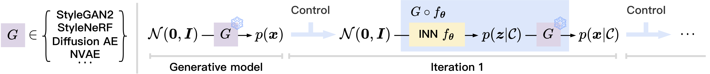
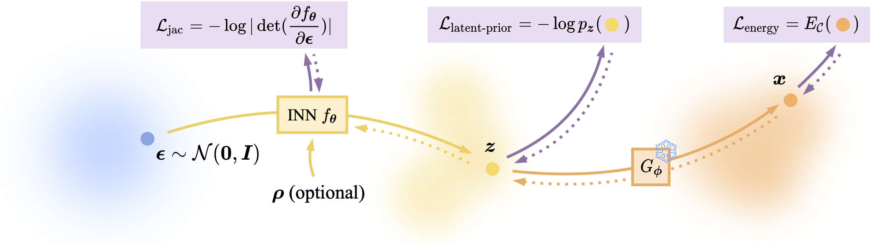

# Generative Visual Prompt: Unifying Distributional Control of Pre-Trained Generative Models

Official PyTorch implementation of our **NeurIPS 2022** paper <br>
**Generative Visual Prompt: Unifying Distributional Control of Pre-Trained Generative Models** <br>
Chen Henry Wu, Saman Motamed, Shaunak Srivastava, Fernando De la Torre <br>
Carnegie Mellon University <br>
NeurIPS 2022

[**[Paper link]**](https://arxiv.org/abs/2209.06970)

### Notes
1. Feel free to email me if you think I should cite your work! 

## Overview


Generative models (e.g., GANs and diffusion models) learn the underlying data distribution in an unsupervised manner. 
However, many applications of interest require sampling from a specific region of the generative model's output space or evenly over a range of characteristics. 
To allow efficient sampling in these scenarios, we propose **Generative Visual Prompt (PromptGen)**, a framework to achieve distributional control over pre-trained generative models by incorporating knowledge of arbitrary off-the-shelf models. 
PromptGen defines control as an energy-based model (EBM) and samples images in a feed-forward manner by approximating the EBM with invertible neural networks, avoiding optimization at inference. 
We demonstrate how PromptGen can control several generative models (e.g., **StyleGAN2**, **diffusion autoencoder**, **StyleNeRF**, **NVAE**) using various off-the-shelf models: 
1. With the CLIP model, PromptGen can sample images guided by the text.
2. With image classifiers, PromptGen can de-bias generative models across a set of attributes.
3. With inverse graphics models, PromptGen can sample images of the same identity in different poses. 
4. Finally, PromptGen reveals that the CLIP model shows "reporting bias" when used as control, and PromptGen can further de-bias this controlled distribution in an iterative manner.



PromptGen requires _no training data_, and the only supervision comes from off-the-shelf models that help define the control. 
It samples images in a _feed-forward_ manner, which is highly efficient, and it also _stands alone_ at inference, meaning that we can discard the off-the-shelf models after training.
PromptGen not only offers _generality_ for algorithmic design and _modularity_ for control composition, 
but also enables _iterative_ controls when some controls are contingent on others. 



## Contents
+ [This repository](#generative-visual-prompt-unifying-distributional-control-of-pre-trained-generative-models)
  + [Overview](#overview)
  + [Contents](#contents)
  + [Dependencies](#dependencies)
  + [Pre-trained checkpoints](#pre-trained-checkpoints)
  + [Usage](#usage)
    + [Overview](#overview)
    + [CLIP-guided text-to-image synthesis](#clip-guided-text-to-image-synthesis)
    + [Inverse graphics model-guided image synthesis](#inverse-graphics-model-guided-image-synthesis)
    + [Classifier-guided image synthesis](#classifier-guided-image-synthesis)
    + [De-biasing generative models with the moment constraint](#de-biasing-generative-models-with-the-moment-constraint)
    + [Iterative control](#iterative-control)
  + [Citation](#citation)
  + [Contact](#contact)


## Dependencies

1. Create environment by running
```shell
conda env create -f environment.yml
conda activate generative_prompt
pip install git+https://github.com/openai/CLIP.git
```
2. Install `torch` and `torchvision` based on your CUDA version. 
3. Install [PyTorch 3D](https://github.com/facebookresearch/pytorch3d). Installing this library can be painful, but you can skip it if you are not using StyleNeRF or the pose experiments.
4. Set up [wandb](https://wandb.ai/) for logging (registration is required). You should modify the ```setup_wandb``` function in ```main.py``` to accomodate your wandb credentials.

## Pre-trained checkpoints

### Pre-trained generative models
We provide a unified interface for various pre-trained generative models. Checkpoints for generative models used in this paper are provided below. 
1. StyleGAN2
```shell
cd ckpts/
wget https://www.dropbox.com/s/iy0dkqnkx7uh2aq/ffhq.pt
wget https://www.dropbox.com/s/lmjdijm8cfmu8h1/metfaces.pt
wget https://www.dropbox.com/s/z1vts069w683py5/afhqcat.pt
wget https://www.dropbox.com/s/a0hvdun57nvafab/stylegan2-church-config-f.pt
wget https://www.dropbox.com/s/x1d19u8zd6yegx9/stylegan2-car-config-f.pt
wget https://www.dropbox.com/s/hli2x42ekdaz2br/landscape.pt
```
2. Diffusion Autoencoder
```shell
cd ckpts/
wget https://www.dropbox.com/s/ej0jj8g7crvtb5e/diffae_ffhq256.ckpt
wget https://www.dropbox.com/s/w5y89y57r9nd1jt/diffae_ffhq256_latent.pkl
wget https://www.dropbox.com/s/rsbpxaswnfzsyl1/diffae_ffhq128.ckpt
wget https://www.dropbox.com/s/v1dvsj6oklpz652/diffae_ffhq128_latent.pkl
```
3. StyleNeRF
```shell
cd ckpts/
wget https://www.dropbox.com/s/n80cr7isveh5yfu/StyleNeRF_ffhq_1024.pkl
```
3. BigGAN
```text
# BigGAN will be downloaded automatically
```

### Pre-trained off-the-shelf models
PromptGen allows us to use arbitrary off-the-shelf models to control pre-trained generative models. The off-the-shelf models used in this paper are provided below. 
1. CLIP
```text
# CLIP will be downloaded automatically
```
2. ArcFace IR-SE 50 model, provided by the Colab demo in [this repo](https://github.com/orpatashnik/StyleCLIP)
```shell
cd ckpts/
wget https://www.dropbox.com/s/qg7co4azsv5sacm/model_ir_se50.pth
```
3. DECA model, provided by [this repo](https://github.com/YadiraF/DECA). 
You should first download the [FLAME model](https://flame.is.tue.mpg.de/download.php) (registration is required), 
choose **FLAME 2020** and unzip it, 
copy `generic_model.pkl` into `model/lib/decalib/data/`, and then run the following command 
```shell
wget https://www.dropbox.com/s/972j1vgfd19b6gx/deca_model.tar -O model/lib/decalib/data/deca_model.tar
```
4. FairFace classifier, provided by [this repo](https://github.com/dchen236/FairFace) 
```shell
cd ckpts/
wget https://www.dropbox.com/s/v1rp0uubk30esdh/res34_fair_align_multi_7_20190809.pt
```
5. CelebA classifier, trained by ourselves
```shell
cd ckpts/
wget https://www.dropbox.com/s/yzc8ydaa4ggj1zs/celeba.zip
unzip celeba.zip 
```

### Pre-trained $\hat{\beta}$ models (for the moment constraint)
For the moment constraint experiments, one need to train the $\hat{\beta}$ model based on the given pre-trained generative model and moment constraint. Although you can train the $\hat{\beta}$ models following our instruction described later, we provide the pre-trained checkpoints here.
1. FFHQ (1024) $\hat{\beta}$ model
```shell
cd ckpts/
wget https://www.dropbox.com/s/htdfv5w1xzsnajj/ffhq_debias.bin
```
2. MetFaces (1024) $\hat{\beta}$ model
```shell
cd ckpts/
wget https://www.dropbox.com/s/j2z9lha15mb2hfj/metfaces_debias.bin
```

## Usage

### Overview

Generally, each block stands for an experiment, with the following exceptions:
1. Each set notation `{A,B,C}` stands for several independent experiments. 
You should always replace `{A,B,C}` with one of `A`, `B`, and `C`. 
2. In [some cases](#inverse-graphics-model-guided-image-synthesis), evaluation and plotting are separated from training. These cases are usually marked by `After convergence`.
3. For de-biasing with the moment constraint, the `(optional)` means that you can use the pre-trained $\hat{\beta}$ model following the [instruction above](#pre-trained-hatbeta-models-for-the-moment-constraint). 
4. For [iterative control](#iterative-control), all blocks should be run sequentially. 

Each command can be run on a single NVIDIA RTX A4000 GPU.
Model checkpoints and image samples will be saved under `--output_dir`. 


### CLIP-guided text-to-image synthesis

#### StyleGAN2 FFHQ (1024) "a photo of {a baby, an asian man, a girl, a boy}"
```shell
export CUDA_VISIBLE_DEVICES=0
export RUN_NAME=clip_{a_baby,an_asian_man,a_girl,a_boy}_ffhq
export SEED=42
nohup python -m torch.distributed.launch --nproc_per_node 1 --master_port 1234 main.py --seed $SEED --cfg experiments/$RUN_NAME.cfg --run_name $RUN_NAME$SEED --logging_strategy steps --logging_first_step true --logging_steps 4 --evaluation_strategy steps --eval_steps 50 --metric_for_best_model CLIPEnergy --greater_is_better false --save_strategy steps --save_steps 50 --save_total_limit 1 --load_best_model_at_end --gradient_accumulation_steps 4 --num_train_epochs 10 --adafactor false --learning_rate 1e-3 --do_train --do_eval --output_dir output/$RUN_NAME$SEED --overwrite_output_dir --per_device_train_batch_size 2 --per_device_eval_batch_size 4 --eval_accumulation_steps 4 --ddp_find_unused_parameters true --verbose true > $RUN_NAME$SEED.log 2>&1 &
```

####  Diffusion Autoencoder FFHQ256 "a photo of a baby"
```shell
export CUDA_VISIBLE_DEVICES=0
export RUN_NAME=clip_a_baby_ffhq256_diffae
export SEED=42
nohup python -m torch.distributed.launch --nproc_per_node 1 --master_port 1433 main.py --seed $SEED --cfg experiments/$RUN_NAME.cfg --run_name $RUN_NAME$SEED --logging_strategy steps --logging_first_step true --logging_steps 4 --evaluation_strategy steps --eval_steps 50 --metric_for_best_model CLIPEnergy --greater_is_better false --save_strategy steps --save_steps 50 --save_total_limit 1 --load_best_model_at_end --gradient_accumulation_steps 4 --num_train_epochs 10 --adafactor false --learning_rate 1e-3 --do_train --do_eval --output_dir output/$RUN_NAME$SEED --overwrite_output_dir --per_device_train_batch_size 2 --per_device_eval_batch_size 4 --eval_accumulation_steps 4 --ddp_find_unused_parameters true --verbose true > $RUN_NAME$SEED.log 2>&1 &
```

#### StyleGAN2 Landscape (256) "{autumn, winter} scene"
```shell
export CUDA_VISIBLE_DEVICES=0
export RUN_NAME=clip_{autumn,winter}_scene_landscape
export SEED=42
nohup python -m torch.distributed.launch --nproc_per_node 1 --master_port 1234 main.py --seed $SEED --cfg experiments/$RUN_NAME.cfg --run_name $RUN_NAME$SEED --logging_strategy steps --logging_first_step true --logging_steps 4 --evaluation_strategy steps --eval_steps 50 --metric_for_best_model CLIPEnergy --greater_is_better false --save_strategy steps --save_steps 50 --save_total_limit 1 --load_best_model_at_end --gradient_accumulation_steps 2 --num_train_epochs 10 --adafactor false --learning_rate 1e-3 --do_train --do_eval --output_dir output/$RUN_NAME$SEED --overwrite_output_dir --per_device_train_batch_size 4 --per_device_eval_batch_size 8 --eval_accumulation_steps 4 --ddp_find_unused_parameters true --verbose true > $RUN_NAME$SEED.log 2>&1 &
```

#### StyleNeRF FFHQ (1024) "a photo of {a baby}"
```shell
export CUDA_VISIBLE_DEVICES=0
export RUN_NAME=clip_a_baby_ffhq1024_stylenerf
export SEED=42
nohup python -m torch.distributed.launch --nproc_per_node 1 --master_port 1234 main.py --seed $SEED --cfg experiments/$RUN_NAME.cfg --run_name $RUN_NAME$SEED --logging_strategy steps --logging_first_step true --logging_steps 4 --evaluation_strategy steps --eval_steps 50 --metric_for_best_model CLIPEnergy --greater_is_better false --save_strategy steps --save_steps 50 --save_total_limit 1 --load_best_model_at_end --gradient_accumulation_steps 4 --num_train_epochs 10 --adafactor false --learning_rate 1e-3 --do_train --do_eval --output_dir output/$RUN_NAME$SEED --overwrite_output_dir --per_device_train_batch_size 2 --per_device_eval_batch_size 4 --eval_accumulation_steps 4 --ddp_find_unused_parameters true --verbose true > $RUN_NAME$SEED.log 2>&1 &
```

#### BigGAN ImageNet (256) {"a photo of a glow and light dog", "an ink wash of a church near forest under moonlight", "a painting of a melancholy robot"}
```shell
export CUDA_VISIBLE_DEVICES=0
export RUN_NAME={clip_photo_of_a_glow_and_light_dog_biggan,clip_ink_wash_of_a_church_near_forest_under_moonlight_biggan,clip_painting_of_a_melancholy_robot_biggan}
export SEED=42
nohup python -m torch.distributed.launch --nproc_per_node 1 --master_port 1234 main.py --seed $SEED --cfg experiments/$RUN_NAME.cfg --run_name $RUN_NAME$SEED --logging_strategy steps --logging_first_step true --logging_steps 4 --evaluation_strategy steps --eval_steps 200 --metric_for_best_model CLIPEnergy --greater_is_better false --save_strategy steps --save_steps 200 --save_total_limit 1 --load_best_model_at_end --gradient_accumulation_steps 1 --num_train_epochs 15 --adafactor false --learning_rate 1e-3 --do_train --do_eval --output_dir output/$RUN_NAME$SEED --overwrite_output_dir --per_device_train_batch_size 4 --per_device_eval_batch_size 8 --eval_accumulation_steps 4 --ddp_find_unused_parameters true --verbose true > $RUN_NAME$SEED.log 2>&1 &
```

---

### Inverse graphics model-guided image synthesis

#### StyleGAN2 FFHQ (1024) pose control
```shell
export CUDA_VISIBLE_DEVICES=0
export RUN_NAME=inverse_graphics_pose_ffhq
export SEED=42
nohup python -m torch.distributed.launch --nproc_per_node 1 --master_port 1234 main.py --seed $SEED --cfg experiments/$RUN_NAME.cfg --run_name $RUN_NAME$SEED --logging_strategy steps --logging_first_step true --logging_steps 4 --evaluation_strategy steps --eval_steps 100 --metric_for_best_model PoseEnergy --greater_is_better false --save_strategy steps --save_steps 100 --save_total_limit 1 --load_best_model_at_end --gradient_accumulation_steps 1 --num_train_epochs 10 --adafactor false --learning_rate 1e-3 --do_train --do_eval --output_dir output/$RUN_NAME$SEED --overwrite_output_dir --per_device_train_batch_size 4 --per_device_eval_batch_size 8 --eval_accumulation_steps 4 --ddp_find_unused_parameters true --verbose true > $RUN_NAME$SEED.log 2>&1 &
```
After convergence, evaluate and plot by running
```shell
export CUDA_VISIBLE_DEVICES=0
export RUN_NAME=inverse_graphics_pose_ffhq_test_fid
export SEED=42
nohup python -m torch.distributed.launch --nproc_per_node 1 --master_port 1234 main.py --seed $SEED --cfg experiments/$RUN_NAME.cfg --run_name $RUN_NAME$SEED --logging_strategy steps --logging_first_step true --logging_steps 4 --evaluation_strategy steps --eval_steps 100 --metric_for_best_model PoseEnergy --greater_is_better false --save_strategy steps --save_steps 100 --save_total_limit 1 --load_best_model_at_end --gradient_accumulation_steps 1 --num_train_epochs 0 --adafactor true --learning_rate 1e-3 --do_eval --output_dir output/$RUN_NAME$SEED --overwrite_output_dir --per_device_train_batch_size 4 --per_device_eval_batch_size 8 --eval_accumulation_steps 4 --ddp_find_unused_parameters true --verbose true --resume_from_checkpoint output/inverse_graphics_pose_ffhq42 > $RUN_NAME$SEED.log 2>&1 &
```

---

### Classifier-guided image synthesis
#### StyleGAN2 FFHQ (1024) classifier control
```shell
export CUDA_VISIBLE_DEVICES=0
export RUN_NAME=class_{male,female,female_glasses,female_noglasses,male_glasses,male_noglasses,female_young,female_old,male_young,male_old,noeyeglasses_young,noeyeglasses_old,eyeglasses_young,eyeglasses_old,blond_hair,noblond_hair,eyeglasses,noeyeglasses}
export SEED=42
nohup python -m torch.distributed.launch --nproc_per_node 1 --master_port 1234 main.py --seed $SEED --cfg experiments/$RUN_NAME.cfg --run_name $RUN_NAME$SEED --logging_strategy steps --logging_first_step true --logging_steps 4 --evaluation_strategy steps --eval_steps 50 --metric_for_best_model ClassEnergy --greater_is_better false --save_strategy steps --save_steps 50 --save_total_limit 1 --load_best_model_at_end --gradient_accumulation_steps 1 --num_train_epochs 10 --adafactor false --learning_rate 1e-3 --do_train --do_eval --do_predict --output_dir output/$RUN_NAME$SEED --overwrite_output_dir --per_device_train_batch_size 8 --per_device_eval_batch_size 4 --eval_accumulation_steps 4 --ddp_find_unused_parameters true --verbose true > $RUN_NAME$SEED.log 2>&1 &
```

---

### De-biasing generative models with the moment constraint

#### (Optional) Train $\hat{\beta}$ model for StyleGAN2 FFHQ (1024) 
This step can be skipped if you download the pre-trained $\hat{\beta}$ model following the instruction above.
```shell
export CUDA_VISIBLE_DEVICES=0
export RUN_NAME=debias_ebm_ffhq
export SEED=42
nohup python -m torch.distributed.launch --nproc_per_node 1 --master_port 1234 main.py --seed $SEED --cfg experiments/$RUN_NAME.cfg --run_name $RUN_NAME$SEED --logging_strategy steps --logging_first_step true --logging_steps 4 --evaluation_strategy steps --eval_steps 100 --metric_for_best_model get_debias_ebm/neg_weighted_loss --greater_is_better true --save_strategy steps --save_steps 100 --save_total_limit 1 --load_best_model_at_end --gradient_accumulation_steps 1 --num_train_epochs 500 --adafactor false --learning_rate 5e-2 --do_train --do_eval --output_dir output/$RUN_NAME$SEED --overwrite_output_dir --per_device_train_batch_size 1024 --per_device_eval_batch_size 16 --eval_accumulation_steps 4 --ddp_find_unused_parameters true --verbose true > $RUN_NAME$SEED.log 2>&1 &
```
After convergence, move the trained checkpoint to `ckpts/` by running
```shell
cd output/debias_ebm_ffhq42
scp -r pytorch_model.bin ../../ckpts/ffhq_debias.bin
```

#### (Optional) Train $\hat{\beta}$ model for StyleGAN2 MetFaces (1024) 
This step can be skipped if you download the pre-trained $\hat{\beta}$ model following the instruction above.
```shell
export CUDA_VISIBLE_DEVICES=0
export RUN_NAME=debias_ebm_metfaces
export SEED=42
nohup python -m torch.distributed.launch --nproc_per_node 1 --master_port 1234 main.py --seed $SEED --cfg experiments/$RUN_NAME.cfg --run_name $RUN_NAME$SEED --logging_strategy steps --logging_first_step true --logging_steps 4 --evaluation_strategy steps --eval_steps 100 --metric_for_best_model get_debias_ebm/neg_weighted_loss --greater_is_better true --save_strategy steps --save_steps 100 --save_total_limit 1 --load_best_model_at_end --gradient_accumulation_steps 1 --num_train_epochs 500 --adafactor false --learning_rate 5e-2 --do_train --do_eval --output_dir output/$RUN_NAME$SEED --overwrite_output_dir --per_device_train_batch_size 1024 --per_device_eval_batch_size 16 --eval_accumulation_steps 4 --ddp_find_unused_parameters true --verbose true > $RUN_NAME$SEED.log 2>&1 &
```
After convergence, move the trained checkpoint to `ckpts/` by running
```shell
cd output/debias_ebm_metfaces42
scp -r pytorch_model.bin ../../ckpts/metfaces_debias.bin
```

#### StyleGAN2 FFHQ (1024) {race, age} de-bias, lambda = {1, 2}
```shell
export CUDA_VISIBLE_DEVICES=0
export RUN_NAME={race,age}_debias_{1,2}_ffhq
export SEED=42
nohup python -m torch.distributed.launch --nproc_per_node 1 --master_port 1234 main.py --seed $SEED --cfg experiments/$RUN_NAME.cfg --run_name $RUN_NAME$SEED --logging_strategy steps --logging_first_step true --logging_steps 4 --evaluation_strategy steps --eval_steps 200 --metric_for_best_model ffhq_debias/race_kl --greater_is_better false --save_strategy steps --save_steps 200 --save_total_limit 1 --load_best_model_at_end --gradient_accumulation_steps 32 --num_train_epochs 500 --adafactor false --learning_rate 1e-3 --do_train --do_eval --do_predict --output_dir output/$RUN_NAME$SEED --overwrite_output_dir --per_device_train_batch_size 8 --per_device_eval_batch_size 8 --eval_accumulation_steps 4 --ddp_find_unused_parameters true --verbose true > $RUN_NAME$SEED.log 2>&1 &
```

#### StyleGAN2 MetFaces (1024) {race, age, gender} de-bias, lambda = {1, 2}
```shell
export CUDA_VISIBLE_DEVICES=0
export RUN_NAME={race,age,gender}_debias_{1,2}_metfaces
export SEED=42
nohup python -m torch.distributed.launch --nproc_per_node 1 --master_port 1234 main.py --seed $SEED --cfg experiments/$RUN_NAME.cfg --run_name $RUN_NAME$SEED --logging_strategy steps --logging_first_step true --logging_steps 4 --evaluation_strategy steps --eval_steps 200 --metric_for_best_model metfaces_debias/age_kl --greater_is_better false --save_strategy steps --save_steps 200 --save_total_limit 1 --load_best_model_at_end --gradient_accumulation_steps 32 --num_train_epochs 500 --adafactor false --learning_rate 1e-3 --do_train --do_eval --do_predict --output_dir output/$RUN_NAME$SEED --overwrite_output_dir --per_device_train_batch_size 8 --per_device_eval_batch_size 8 --eval_accumulation_steps 4 --ddp_find_unused_parameters true --verbose true > $RUN_NAME$SEED.log 2>&1 &
```

---

### Iterative control

#### (Iteration 1) StyleGAN2 FFHQ (1024) "a photo of a person without makeup" 
```shell
export CUDA_VISIBLE_DEVICES=0
export RUN_NAME=clip_a_person_without_makeup
export SEED=42
nohup python -m torch.distributed.launch --nproc_per_node 1 --master_port 1234 main.py --seed $SEED --cfg experiments/$RUN_NAME.cfg --run_name $RUN_NAME$SEED --logging_strategy steps --logging_first_step true --logging_steps 4 --evaluation_strategy steps --eval_steps 50 --metric_for_best_model CLIPEnergy --greater_is_better false --save_strategy steps --save_steps 50 --save_total_limit 1 --load_best_model_at_end --gradient_accumulation_steps 1 --num_train_epochs 10 --adafactor false --learning_rate 1e-3 --do_train --do_eval --do_predict --output_dir output/$RUN_NAME$SEED --overwrite_output_dir --per_device_train_batch_size 2 --per_device_eval_batch_size 4 --eval_accumulation_steps 4 --ddp_find_unused_parameters true --verbose true > $RUN_NAME$SEED.log 2>&1 &
```
After convergence, compute gender distribution by running
```shell
export CUDA_VISIBLE_DEVICES=0
export RUN_NAME=no_debias_person_without_makeup
export SEED=42
nohup python -m torch.distributed.launch --nproc_per_node 1 --master_port 1234 main.py --seed $SEED --cfg experiments/$RUN_NAME.cfg --run_name $RUN_NAME$SEED --logging_strategy steps --logging_first_step true --logging_steps 4 --evaluation_strategy steps --eval_steps 50 --metric_for_best_model CLIPEnergy --greater_is_better false --save_strategy steps --save_steps 50 --save_total_limit 1 --load_best_model_at_end --gradient_accumulation_steps 1 --num_train_epochs 0 --adafactor false --learning_rate 1e-3 --do_eval --do_predict --output_dir output/$RUN_NAME$SEED --overwrite_output_dir --per_device_train_batch_size 2 --per_device_eval_batch_size 4 --eval_accumulation_steps 4 --ddp_find_unused_parameters true --verbose true > $RUN_NAME$SEED.log 2>&1 &
```

#### (Preparation for iteration 2) Train $\hat{\beta}$ model for StyleGAN2 FFHQ (1024) "a photo of a person without makeup" 
```shell
export CUDA_VISIBLE_DEVICES=0
export RUN_NAME=debias_ebm_person_without_makeup
export SEED=42
nohup python -m torch.distributed.launch --nproc_per_node 1 --master_port 1234 main.py --seed $SEED --cfg experiments/$RUN_NAME.cfg --run_name $RUN_NAME$SEED --logging_strategy steps --logging_first_step true --logging_steps 4 --evaluation_strategy steps --eval_steps 100 --metric_for_best_model get_debias_ebm/neg_weighted_loss --greater_is_better true --save_strategy steps --save_steps 100 --save_total_limit 1 --load_best_model_at_end --gradient_accumulation_steps 1 --num_train_epochs 500 --adafactor false --learning_rate 5e-2 --do_train --do_eval --output_dir output/$RUN_NAME$SEED --overwrite_output_dir --per_device_train_batch_size 1024 --per_device_eval_batch_size 16 --eval_accumulation_steps 4 --ddp_find_unused_parameters true --verbose true > $RUN_NAME$SEED.log 2>&1 &
```
After convergence, move the trained checkpoint to `ckpts/` by running
```shell
cd output/debias_ebm_person_without_makeup42
scp -r pytorch_model.bin ../../ckpts/person_without_makeup_gender_debias.bin
```

#### (Iteration 2) StyleGAN2 FFHQ (1024) "a photo of a person without makeup" gender de-bias, lambda = 2
```shell
export CUDA_VISIBLE_DEVICES=0
export RUN_NAME=gender_debias_2_person_without_makeup
export SEED=42
nohup python -m torch.distributed.launch --nproc_per_node 1 --master_port 1234 main.py --seed $SEED --cfg experiments/$RUN_NAME.cfg --run_name $RUN_NAME$SEED --logging_strategy steps --logging_first_step true --logging_steps 4 --evaluation_strategy steps --eval_steps 200 --metric_for_best_model ffhq_debias/gender_kl --greater_is_better false --save_strategy steps --save_steps 200 --save_total_limit 1 --load_best_model_at_end --gradient_accumulation_steps 32 --num_train_epochs 500 --adafactor false --learning_rate 1e-3 --do_train --do_eval --do_predict --output_dir output/$RUN_NAME$SEED --overwrite_output_dir --per_device_train_batch_size 8 --per_device_eval_batch_size 8 --eval_accumulation_steps 4 --ddp_find_unused_parameters true --verbose true > $RUN_NAME$SEED.log 2>&1 &
```

## Citation
If you find this repository helpful, please cite as
```
@inproceedings{promptgen2022,
  title={Generative Visual Prompt: Unifying Distributional Control of Pre-Trained Generative Models},
  author={Chen Henry Wu and Saman Motamed and Shaunak Srivastava and Fernando De la Torre},
  booktitle={Advances in Neural Information Processing Systems},
  year={2022},
}
```


## Contact
[Issues](https://github.com/ChenWu98/Generative-Visual-Prompt/issues) are welcome if you have any question about the code. 
If you would like to discuss the method, please contact [Chen Henry Wu](https://github.com/ChenWu98).

<a href="https://github.com/ChenWu98"></a>
